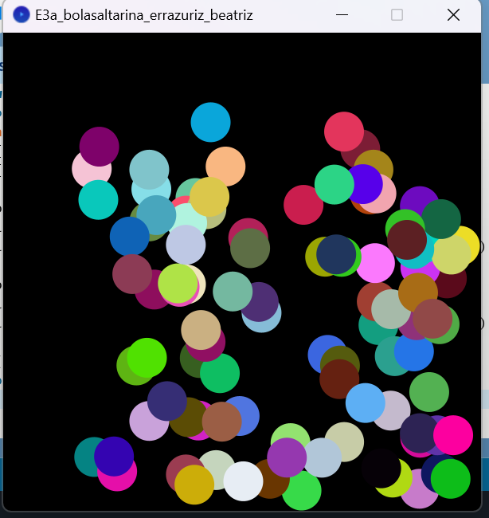

# Bouncing Balls Project

This project is a dynamic visual simulation of bouncing balls, developed using Processing for the *Creative Programming for Design* course during the first semester of 2021 at the Pontifical Catholic University of Chile. The application features multiple colorful balls that move and bounce off the edges of the window, changing color upon collision.

## Project Context

The objective of this project was to creatively explore animations and dynamic systems in Processing. By simulating the movement and interaction of objects (in this case, bouncing balls), the project demonstrates basic physics principles like reflection and velocity, combined with visual elements like color changes.

## How to Run the Project

### Requirements

To run this project, you will need:

- [Processing](https://processing.org/download/) installed on your machine.

### Steps

1. Download or clone the project files.
2. Open the `.pde` file in the Processing IDE.
3. Press the `Run` button (the triangle in the top-left corner of the Processing window) to launch the bouncing balls simulation.

### Code Overview

The simulation consists of:

- **100 balls** that are randomly placed on the screen at the start.
- Each ball has a random velocity and color.
- The balls bounce off the edges of the window and change their color upon collision.

The position and velocity of each ball are updated continuously in the `draw()` function. When a ball hits the boundary of the window, its velocity is reversed, simulating a bounce. The color of the ball also changes randomly when it bounces.

### Features

- **Randomized Colors**: Each ball is assigned a random color at the start and changes its color each time it bounces.
- **Real-time Bouncing**: Balls move and bounce around the window, giving a dynamic animation.
- **Multiple Balls**: The project simulates the interaction of 100 individual balls, each with its own random speed and direction.
